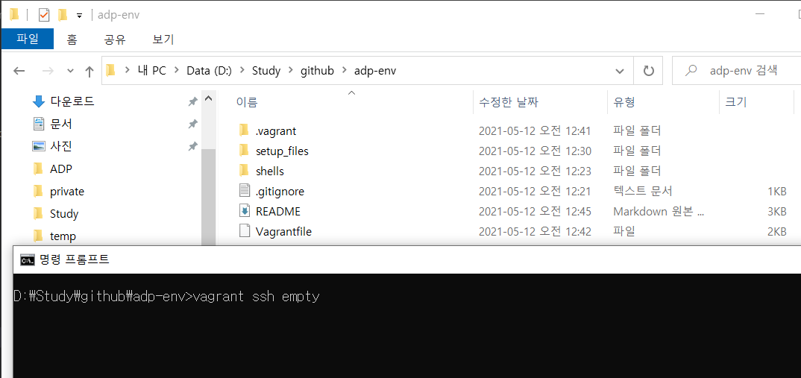
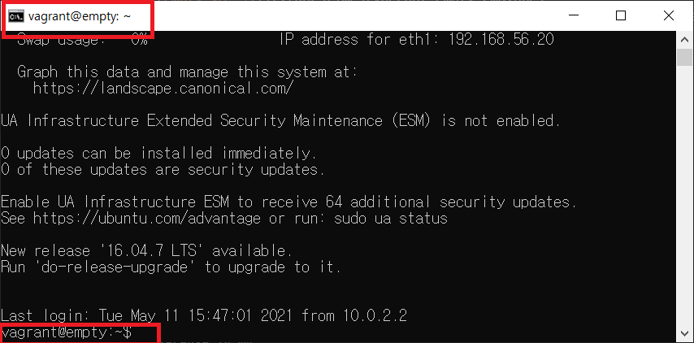
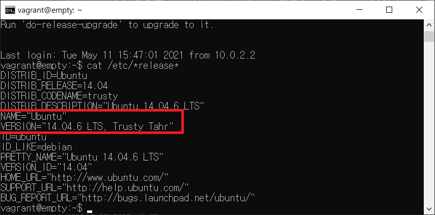

# ADP 실기 연습 환경 구축하기
가상머신(VirtualBox)을 이용해서 Ubuntu 환경에서 실행하는 R Studio Server를 생성하고 실행해 볼 계획입니다.  
Windows 10 을 사용하는 환경에서 작성했습니다.  
  
VirtualBox를 이용해 네트웍 설정해서 직접 구성해도 되지만, 이러한 일을 조금 더 편하게 해주는 Provisioning 도구들이 있습니다.  
여기에서는 Vagrant 라는 도구를 사용하겠습니다.  
  
***이 문서를 따라해서 실행되지 않는 경우에 대한 질문은 따로 받지 않습니다.  ***  
***만약, 따라해서 실행되지 않을 경우에 버릴 시간이 아깝다면, 더 이상 진행하지 마시길 바랍니다. ***  
  

## 1. 설치 준비 사항 
 - Vagrant 설치 파일(V 2.2.14) : https://releases.hashicorp.com/vagrant/2.2.14/vagrant_2.2.14_x86_64.msi    
 - VirtualBox 설치 파일(V 6.1.18) : https://download.virtualbox.org/virtualbox/6.1.18/VirtualBox-6.1.18-142142-Win.exe  
 - Ubuntu 이미지(ubuntu/trusty64) : https://cloud-images.ubuntu.com/vagrant/trusty/current/trusty-server-cloudimg-amd64-vagrant-disk1.box
 - 인터넷 연결 : R Studio Server 설치 및 R 패키지 설치용  

다운로드 받은 `trusty-server-cloudimg-amd64-vagrant-disk1.box` 파일은 `setup_files` 폴더에 옮겨 놓습니다.   
아래에서 이 파일을 사용할 때 경로명을 통일하기 위해서  `setup_files` 폴더에 옮겨 놓습니다.  
명령어에서 사용 시 해당 파일 경로를 잘 지정해서 사용하면 굳이 폴더에 옮겨 놓지 않아도 됩니다.  
  
---  
## 2. 가상머신 실행 환경 설치하기  
>>1. 버추얼 박스 설치  
>>2. Vagrant 설치
>>3. Ubuntu 이미지를 Vagrant 캐시에 추가  
>>4. 미리 작성해 둔 가상 머신 생성 스크립트 호출
  
1. 버추얼 박스 설치  
2. Vagrant 설치
3. Ubuntu 이미지를 Vagrant 캐시에 추가  
```bash
# .box 이미지를 vagrant cache에 미리 등록해 둠 - 가상머신 생성시 설치 이미지를 다운 로드 받는 시간 절약하기 위함.  
# 만약, vagrant 를 삭제하거나 한 경우에는 이미지를 다시 등록해야 할 수 있음. 
vagrant box add ubuntu/trusty64 ./setup_files/trusty-server-cloudimg-amd64-vagrant-disk1.box
# 잘 등록되었는 지 목록 확인.
vagrant box list 
```
4. 미리 작성해 둔 가상 머신 생성 스크립트 호출  
`adp-env` 폴더에서 아래 명령을 실행합니다.  
리눅스만 설치된 가상머신인 `empty`를 시험삼아 실행해 봅니다.  
```bash
vagrant up empty
```
`adp-env` 깃 프로젝트를 다운로드 받은 경로에서 해당 명령을 실행하는 화면은 아래와 같습니다.  
저는 `D:\Study\github\adp-env` 경로에 다운로드 받았기 때문에, 명령창을 열어서 해당 경로로 이동하고 해당 경로에서 실행했습니다.  
  
ssh 연결 명령을 실행하고 조금 기다리면, 윈도우즈 명령창이 아래와 같이 리눅스 명령창 처럼 바뀝니다.  
  
우분투 리눅스가 실행되고 있는게 맞는 지 리눅스? 명령창에서 아래와 같이 설치 버전을 확인해 봅니다.  
```bash
cat /etc/*release* 
```
우분투 14 버전이 실행되는 걸로 나옵니다.  
  
  
***여기까지 정상 실행되면, 가상머신 실행 환경은 정상적으로 설치된 것으로 볼 수 있습니다.*** 

---  
## 3. R Studio 연결하기
이제 ADP 실습용으로 사용할 R Studio 우분투 환경을 실행해 보겠습니다.  


---  
## 4. R Studio 에서 시험결과 리포트 생성하기  

## 5. Vagrant 명령어 간단 설명  


